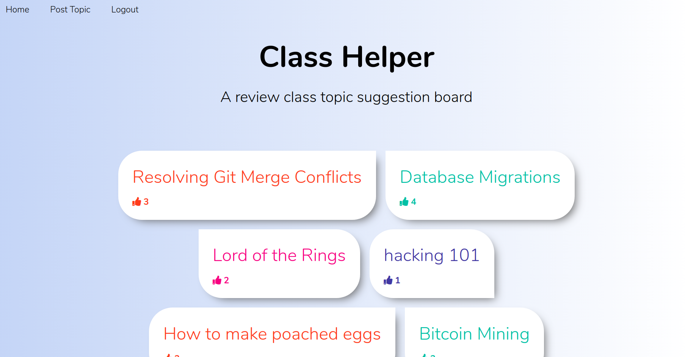
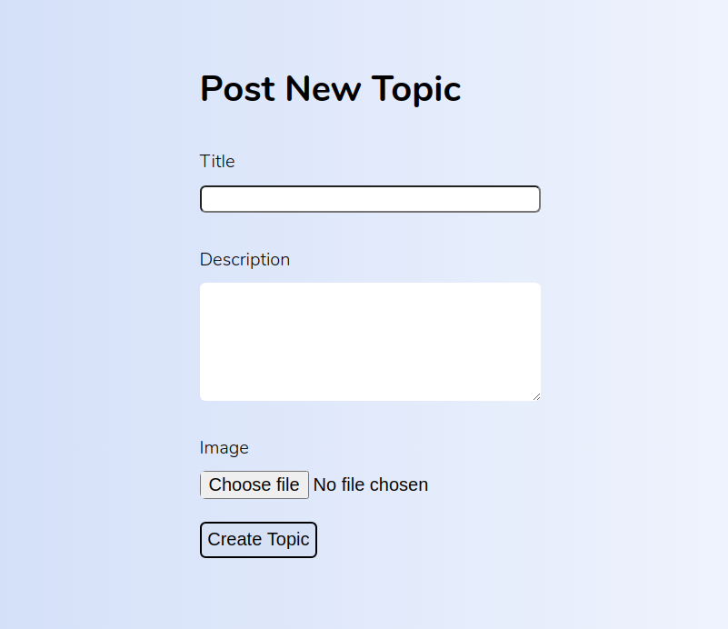
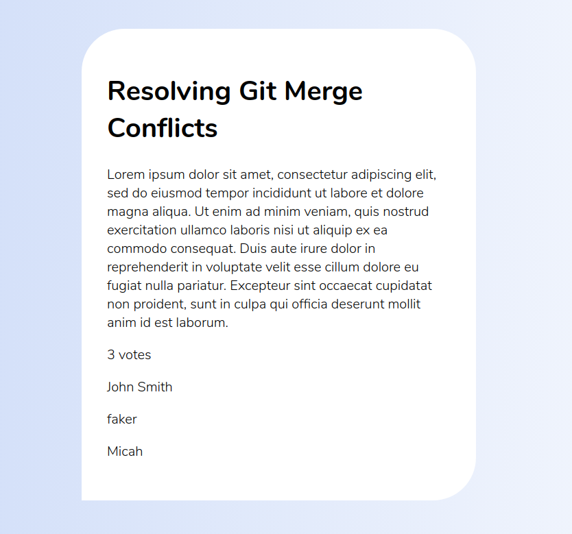
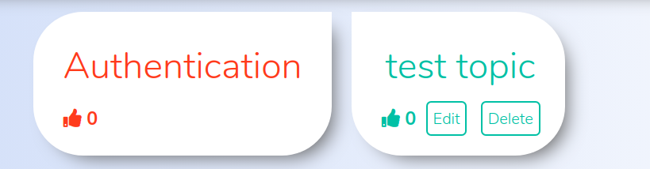

## Topics Board 

### Link to the Website 

https://rocky-ocean-76869.herokuapp.com/

### Test user to test website contents

username: test,

email: "test@mail.com", 

password: "password"

### Purpose

The purpose of the app is having a board for the class where every student can add their topic for the next masterclass / discussion session, and all classmates can vote. This will help the teachers understand what's in demand and prepare the topic.

### Using the website

Any user is able to see the topics board, but only logged in users are able to see the contents of any topic, add new topics, and vote. 

Every user is able to vote once on any particular topic. The votes are calculated and the total number of votes is shown on every topic on the board. The content of a topic shows the description, the image if one was uploaded, number of votes, and the names of the users who voted.

Users are able to edit and delete their own topics.

### Authentiacation and authorization

Devise gem was used for users authentication;
CanCanCan gem was used for authorization.
